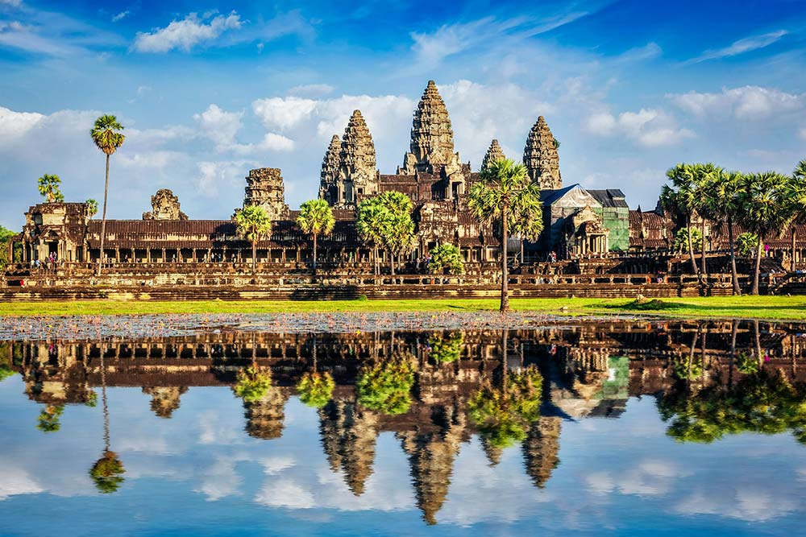

Cambodia is a country full of contrasts, from the majestic temples of Angkor Wat, through the historic streets of Phnom Penh, to the picturesque coast in Sihanoukville. Cambodia's rich history and culture, combined with its wildlife, make the country an ideal destination for any traveler.

&nbsp;

Why is it worth visiting Cambodia?

## Temples of Angkor

A legendary temple complex that is a testament to the power and splendor of the Khmer Empire.

## The capital of Phnom Penh

A place where history meets modernity, offering travelers a fascinating insight into Cambodian urban life.

## The paradise islands of Koh Rong and Koh Rong Samloem

Pristine white beaches, turquoise waters and coral reefs await sunbathers.

## Tonle Sap and floating villages

Discover the lives of local fishermen and see how they have adapted to the changing water levels in the largest lake in Southeast Asia.

## Cambodian cuisine

Flavors such as amok and kuy teav show the richness of the country's culinary traditions