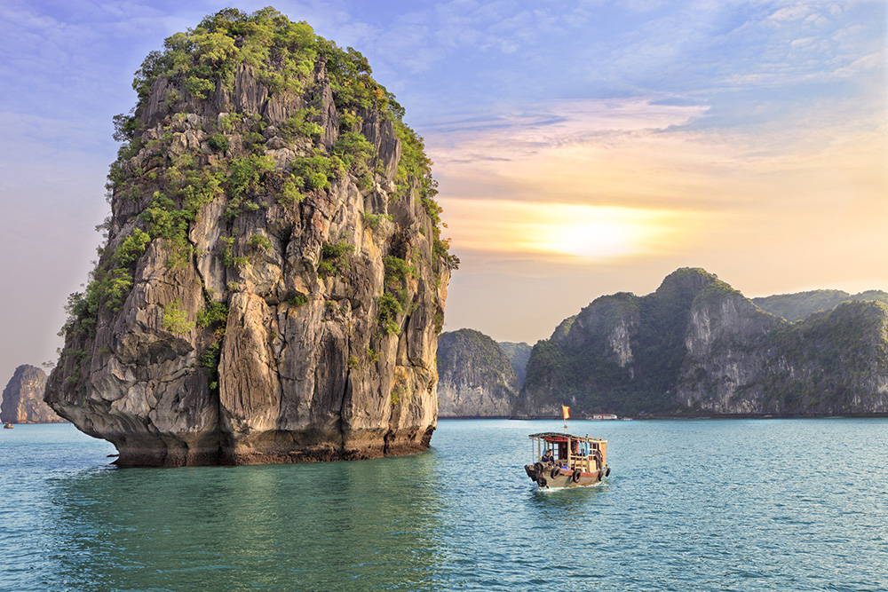
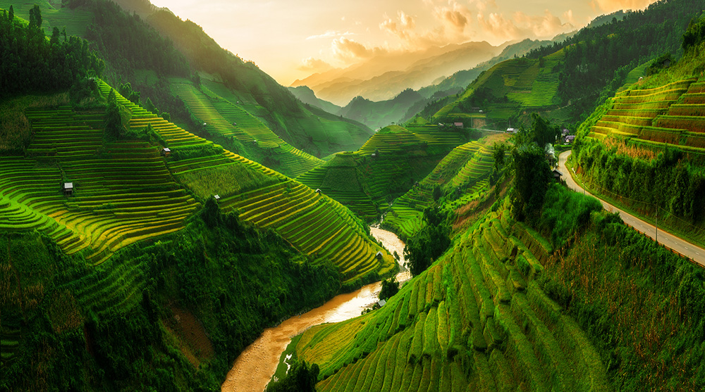

For years, Vietnam has developed in the shadow of its larger neighbors, but today it is definitely coming to light as one of the most fascinating places in Southeast Asia. With a unique blend of traditional culture and modernity, Vietnam offers travelers a rich experience.

&nbsp;

Why is it worth visiting Vietnam?

## Ha Long Bay

Crystal clear waters, limestone cliffs and peaceful fishing villages make it one of the most beautiful places in the world.

## Vietnamese cuisine

From fried dumplings, through pho, to coffee with eggs - culinary enthusiasts will be in seventh heaven.

## The historic cities of Hoi An and Hue

Colorful streets, traditional lanterns and historic palaces make time seem to pass slower here.

## Dynamic Ho Chi Minh and Hanoi

Modernity intertwines with tradition here, and city life pulsates with energy.

## Sapa's rural and mountainous regions

Lush green rice terraces and traditional ethnic communities offer a break from the hustle and bustle of the city.

