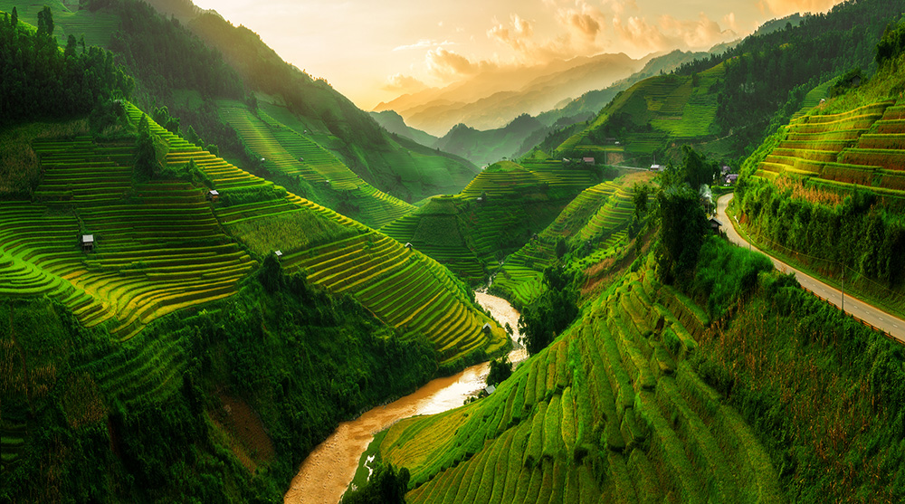

Przez lata Wietnam rozwijał się w cieniu swoich większych sąsiadów, ale dzisiaj zdecydowanie wysuwa się na światło dzienne jako jedno z najbardziej fascynujących miejsc w południowo-wschodniej Azji. Z niezwykłą mieszanką tradycyjnej kultury i nowoczesności, Wietnam oferuje podróżnikom bogate doświadczenia.

&nbsp;

Dlaczego warto odwiedzić Wietnam?

## Zatoka Ha Long

Kryształowo czyste wody, wapienne skały i spokojne wioski rybackie sprawiają, że jest to jedno z najpiękniejszych miejsc na świecie.

## Kuchnia wietnamska

Od smażonych pierożków, przez pho, po kawę z jajkiem – kulinarni entuzjaści będą w siódmym niebie.

## Historyczne miasta Hoi An i Hue

Barwne uliczki, tradycyjne latarnie i historyczne pałace sprawiają, że czas zdaje się tu płynąć wolniej.

## Dynamiczne Ho Chi Minh i Hanoi

Nowoczesność splata się tu z tradycją, a życie miejskie pulsuje z energią.

## Tereny wiejskie i górzyste regiony Sapa

Bujne zielone tarasy ryżowe i tradycyjne społeczności etniczne oferują odskocznię od miejskiego zgiełku.

